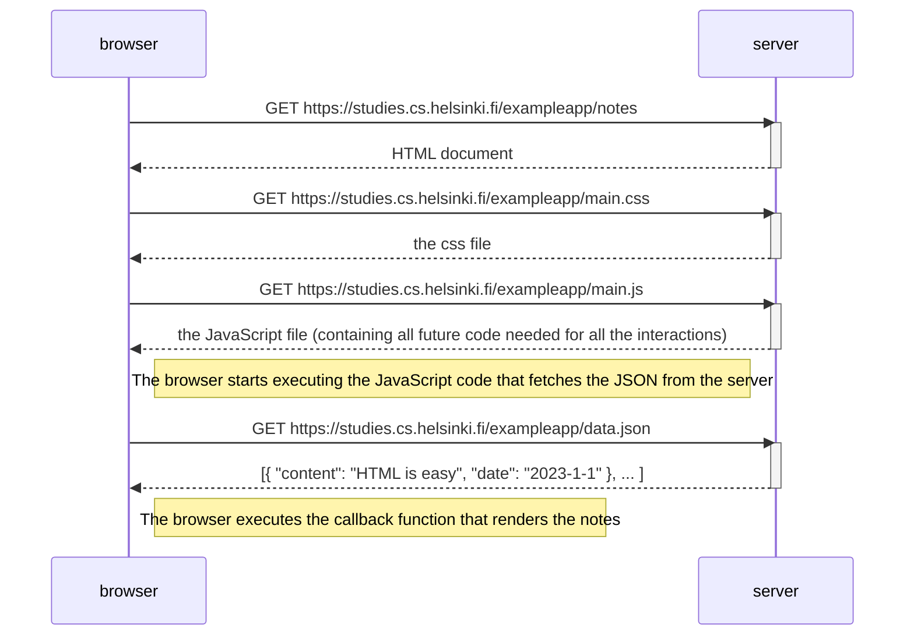
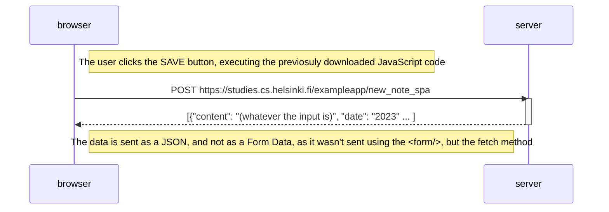

# Part 1

(What happens when loading the page, before any interaction)

```mermaid

sequenceDiagram
    participant browser
    participant server

    browser->>server: GET https://studies.cs.helsinki.fi/exampleapp/notes
    activate server
    server-->>browser: HTML document
    deactivate server

    browser->>server: GET https://studies.cs.helsinki.fi/exampleapp/main.css
    activate server
    server-->>browser: the css file
    deactivate server

    browser->>server: GET https://studies.cs.helsinki.fi/exampleapp/main.js
    activate server
    server-->>browser: the JavaScript file (containing all future code needed for all the interactions)
    deactivate server

    Note right of browser: The browser starts executing the JavaScript code that fetches the JSON from the server

    browser->>server: GET https://studies.cs.helsinki.fi/exampleapp/data.json
    activate server
    server-->>browser: [{ "content": "HTML is easy", "date": "2023-1-1" }, ... ]
    deactivate server

    Note right of browser: The browser executes the callback function that renders the notes
```

# Part 2

(What happens right after the you click the SAVE button)

```mermaid

sequenceDiagram
    participant browser
    participant server

    Note right of browser: The user clicks the SAVE button, executing the previosuly downloaded JavaScript code

    browser->>server: POST https://studies.cs.helsinki.fi/exampleapp/new_note_spa
    activate server
    server-->>browser: [{"content": "(whatever the input is)", "date": "2023" ... ]
    deactivate server

    Note left of server: The data is sent as a JSON, and not as a Form Data, as it wasn't sent using the <form/>, but the fetch method


```